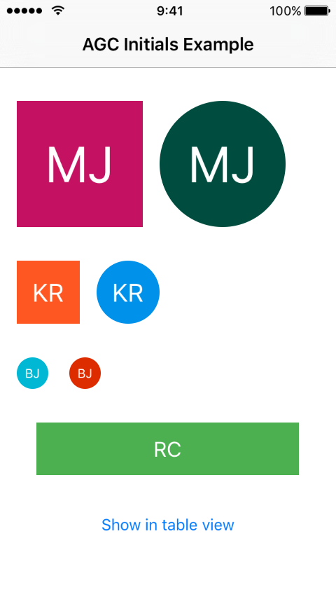
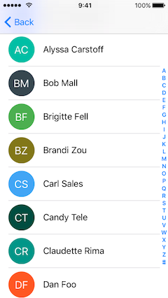

# UIImageView-AGCInitials

[](https://travis-ci.org/andreacipriani/UIImageView-AGCInitials)
[](http://cocoapods.org/pods/UIImageView-AGCInitials)
[](http://cocoapods.org/pods/UIImageView-AGCInitials)
[](http://cocoapods.org/pods/UIImageView-AGCInitials)




 **AGCInitials** is an objc UIImageView category to set the initials of a contact's name as the image placeholder, with a generated background color.

### Features

- Super easy
- The background color of the image will be the same for the same initials, so **you can use it in your table/collection view**. 😎
- You can set your own color palette for background colors
- Good test coverage 💪

### How to use it - Basic

Import the category 

```objective-c
#import "UIImageView+AGCInitials.h"
```
and then just use it:

```objective-c
[_anImageView agc_setImageWithInitialsFromName:@"Mick Jagger"];
```
The image will contain a placeholder with the initials "MJ" and a generated background color.

### How to use it - Details

- You can set the initials without specifying a name, please note that in this case the background color of the image will be the same for the same initials:

```objective-c
- (void)agc_setImageWithInitials:(nonnull NSString*)initials;
```

- The `initialsFromName` method for @"Mick Jagger" and @"Micheal Jagger" still returns *MJ* as initials, but their background color could be different. By default the initials are distinguished by `@" "`, but you can change the separator using:

```objective-c
- (void)agc_setImageWithInitialsFromName:(nonnull NSString*)name separatedByString:(nonnull NSString*)separator;
```

- You can **customize the font** by specifying the text attributes:

```objective-c
NSDictionary* initialsTextAttributes = @{ NSFontAttributeName : [UIFont systemFontOfSize:20], NSForegroundColorAttributeName : [UIColor purpleColor] };
[cellImageView agc_setImageWithInitialsFromName:@"Mick Jagger" separatedByString:@" " withTextAttributes:initialsTextAttributes];
```

- You can also change the **color palette** used to generate background colors:

```objective-c
#import "AGCInitialsColors.h"
```

And then just set your palette before using the category:

```objective-c
NSArray<UIColor*>* yourColorPalette; //...
[[AGCInitialsColors sharedInstance] setColorPalette:yourColorPalette];
```

### Requirements

- iOS 7+

### Installation with Cocoapods

UIImageView-AGCInitials is available through [CocoaPods](http://cocoapods.org). To install
it, simply add the following line to your Podfile:

```ruby
pod "UIImageView-AGCInitials"
```

### Installation without Cocoapods

Copy and paste *AGCInitialsColors.h/m* and *UIImageView+AGCInitials.h/m* classes into your project.

### Run the example 

To run the example project, clone the repo, and run `pod install` from the Example directory first. 

You can even [try the example online with Appetize](https://appetize.io/app/xux5c10x6a3851ryz9ywddu4ng)

### Author

Andrea Cipriani, andrea.g.cipriani@gmail.com - Twitter [@AndreaCipriani](https://twitter.com/AndreaCipriani)

### License

UIImageView-AGCInitials is available under the MIT license. See the LICENSE file for more info.
